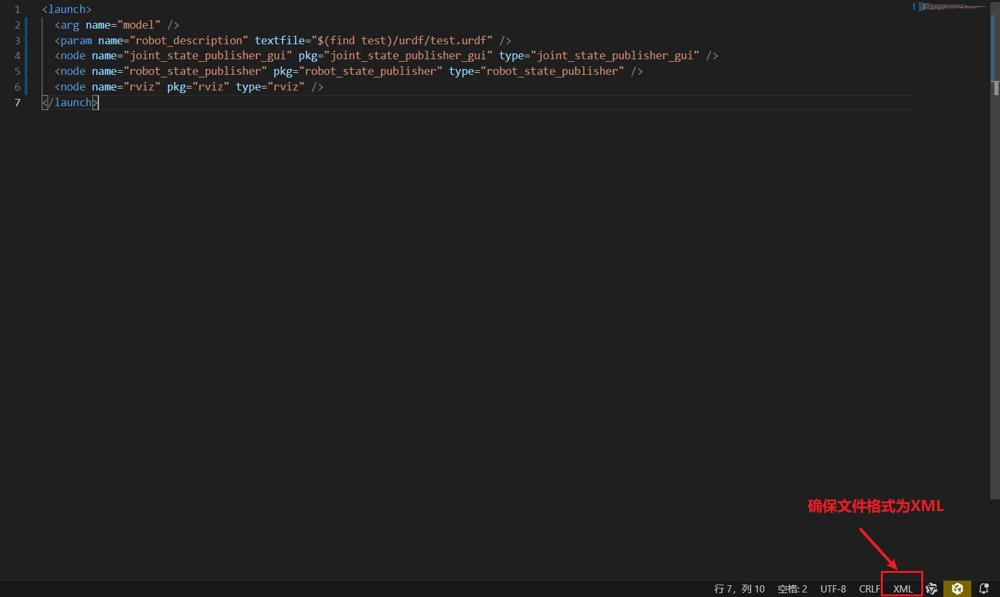
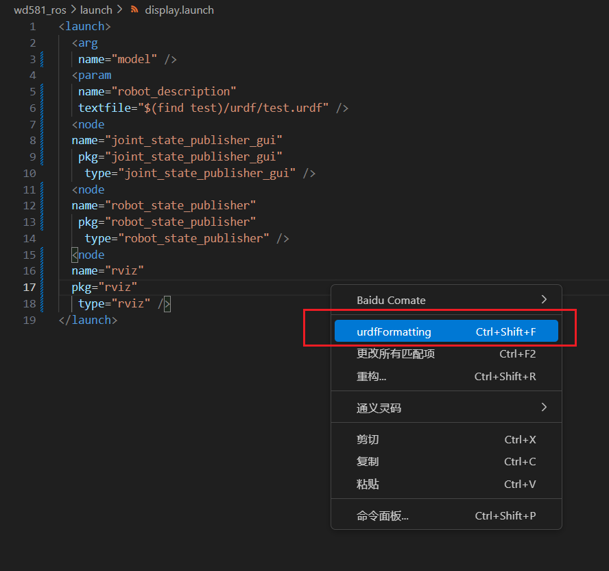
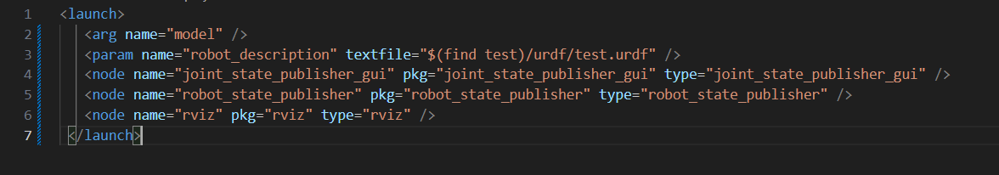
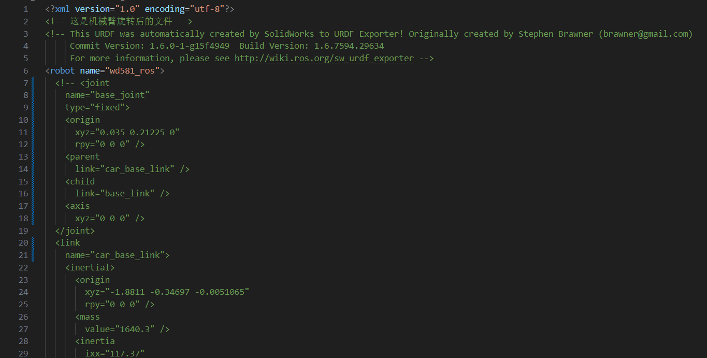
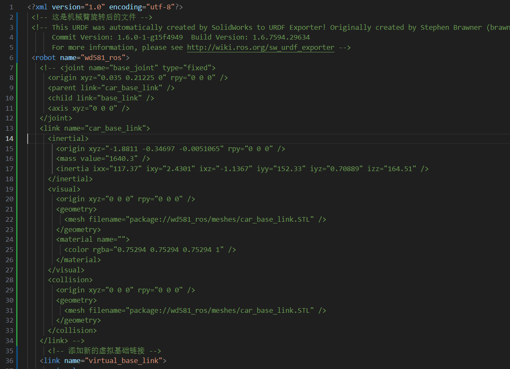

# `urdf-formatting`插件说明

这是`urdf-formatting`的说明文档。
这个插件是用来针对solidworks导出成urdf时候，使用`sw2urdf`插件生成的urdf文件，同一标签内容跨行的现象。

比如，你从solidworks导出成urdf文件，会发现标签内容是跨行了。这就导致文件内容过长，不方便阅读，也会导致内容比较乱。

```xml
<link
name="base_link">
<inertial>
    <origin
    xyz="0.016575 0.012154 1.9091E-10"
    rpy="0 0 0" />
    <mass
    value="23.743" />
    <inertia
    ixx="1.015"
    ixy="-0.0010896"
    ixz="-3.2541E-10"
    iyy="0.48053"
    iyz="-3.0104E-11"
    izz="0.58797" />
</inertial>
</link>
```  

经过格式化，同一标签的内容，将不会跨行。

```xml
<link name="base_link">
  <inertial>
    <origin xyz="0.016575 0.012154 1.9091E-10" rpy="0 0 0" />
    <mass value="23.743" />
    <inertia ixx="1.015" ixy="-0.0010896" ixz="-3.2541E-10" iyy="0.48053" iyz="-3.0104E-11" izz="0.58797" />
  </inertial>
</link>
```

原本2000行的urdf文件，经过格式化后，最后可以缩到1100行左右。大大减少了文件行数。


## 特征

可以用来格式化xml内容，目前支持的格式（因为solidworks中导出的文件，一般只会有`.urdf`和`.launch`文件出现同一标签跨行的现象）
1. `.urdf`
2. `.launch`
3. `.xacro`
4. `.xml`

后续如果有需要，可以增加其他格式，比如`.sdf`文件格式。

## 如何使用
1. 安装，目前有两种方式进行安装。
- **在vscode插件页面，搜索`urdf-formatting`，下载。**
- **在该仓库的Release中下载.vsix文件，然后在VSCode的右上角扩展中选择“从VISX安装”，选择下载的.vsix文件进行安装。**
2. 注意，要使用这款插件，首先确定你要格式化的文件的语言模式是XML，否则，右键不会出现`urdfFormatting`选项。



安装好这个插件后，在urdf文件中右键点击，选择`urdfFormatting`即可。

- 格式化前


- 格式化后


**复杂一点的**

- 格式化前


- 格式化后


特别要说明的一点是，如果你使用这个格式化插件后，所有内容都在同一行中，请确保你的行尾序列是`CRLF`而不是`LF`。而这个行尾序列的选项在文件语言模式旁边。

### v0.0.1

目前只是实现了针对sw2urdf插件生成的urdf文件，将同一标签内容中跨行的内容，合并到同一行。

但是目前经过测试，如果存在一些注释，可能会出错，后续会进行改进。

### v0.0.2
目前版本有如下修改：
1. 修复了`v0.0.1`版本中会复制注释内容。
2. 目前版本，针对文件中有注释，也能够识别注释中的xml格式，进行格式化。

**目前已经在windows10和ubuntu20.04中经过测试。**

目前存在的问题：
1. **如上图格式化后的图片所示，文件内容每一行前面会多出一个空格，后续会进行改进。不过自己也能解决，全选内容，然后按`shift`+`tab`键，就可以去掉前面的空格。**


